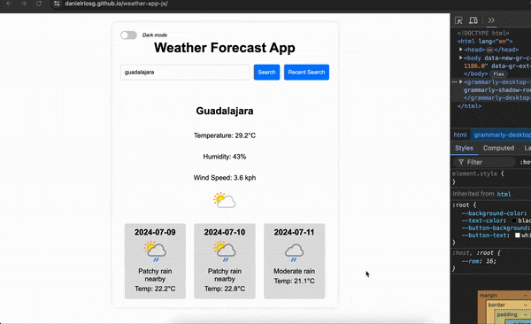

# Weather Forecast App

This is a simple weather forecast application that displays current weather and a three-day forecast for a specified city. The app also includes a dark mode toggle and a recent cities search feature.

## Features

- **Search Weather**: Enter a city name to get current weather and a three-day forecast.
- **Dark Mode**: Toggle between light and dark mode for a better viewing experience.
- **Recent Searches**: View a list of recently searched cities for quick access.

## Technologies Used

- HTML
- CSS (with responsive design)
- JavaScript
- WeatherAPI (for weather data)

## How to Use

1. **Search for Weather**: Enter the name of the city in the input field and click "Search" to get the weather information.
2. **Toggle Dark Mode**: Use the dark mode toggle button located at the top left to switch between light and dark modes.
3. **Recent Searches**: Click "Recent Search" to view and select from your previously searched cities.

## Installation

To run this project locally:

1. Clone the repository:
   ```bash
   git clone https://github.com/danielriosg/weather-forecast-app.git
2. Open index.html in your web browser.

## Demo

You can access a live demo of the app [here](https://danielriosg.github.io/weather-app-js/)

